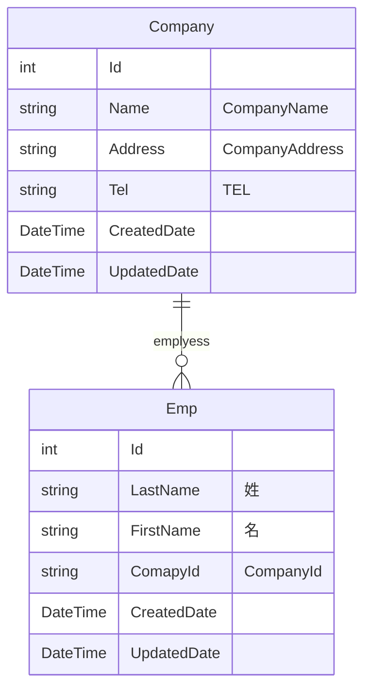

# ERGenerator
ERGenerator is to generate ER diagram from C# source code.
## topic
* Mermaid Markdown text definitions
* Use roslyn parser 
## Step.
1. Ddownload and build
2. Create Templatefile
 see download sample template
3. Execute
ERGenerator "Samples\Sample.tmpl" "Samples" "out.txt"
## ER Sample Diagram

